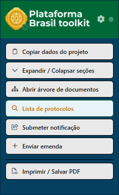
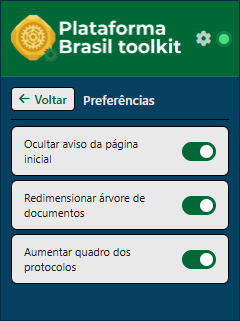

<p align="center">
  
</p>

<h1 align="center">Plataforma Brasil Toolkit</h1>

<p align="center">
  Extensão para Google Chrome que adiciona atalhos e ferramentas de produtividade à <a href="https://plataformabrasil.saude.gov.br">Plataforma Brasil</a> — sistema do Ministério da Saúde para gestão de pesquisas em ética com seres humanos.
</p>

<p align="center">
  
  
  
  
</p>

---

## Funcionalidades

| Ação | Descrição |
|------|-----------|
| **Copiar dados do projeto** | Copia CAAE, Título, Pesquisador Responsável, Área temática, Patrocinador, Emenda atual e Tipo do centro diretamente para a área de transferência |
| **Expandir / Colapsar seções** | Alterna todas as seções recolhíveis da página de uma vez |
| **Aumentar quadro** | Expande o quadro principal para ocupar toda a largura da janela |
| **Abrir árvore de documentos** | Expande e contrai todos os nós da árvore de documentos do projeto |
| **Lista de protocolos** | Salva projetos por nome + CAAE e navega diretamente para eles com um clique (deve estar logado) |
| **Submeter notificação** | Localiza e clica no botão de Enviar Notificação, paginando automaticamente se necessário |
| **Enviar emenda** | Localiza e clica no botão de Submeter Emenda, paginando automaticamente se necessário |
| **Imprimir / Salvar PDF** | Abre o diálogo de impressão do navegador para salvar em PDF |
| **Ocultar aviso da página inicial** | Oculta popup da página inicial |
| **SUGESTÕES** | A próxima sugestão pode ser sua |

---

## Capturas de tela




<!-- Adicione imagens aqui:


-->

---

## Instalação

### Pelo Chrome Web Store

> **Em breve.** A extensão está em processo de publicação na Chrome Web Store. Quando disponível, basta clicar em **Adicionar ao Chrome** — sem nenhuma etapa manual.

---

### Manualmente (modo desenvolvedor)

Use este método enquanto a extensão não está na Chrome Web Store.

#### Passo 1 — Baixar os arquivos

1. Acesse a página do repositório no GitHub
2. Clique no botão verde **`<> Code`** (canto superior direito da lista de arquivos)
3. Clique em **Download ZIP**

   > O navegador vai baixar um arquivo chamado algo como `plataforma-brasil-toolkit-master.zip`

4. Localize o arquivo baixado (geralmente na pasta **Downloads**)
5. Clique com o botão direito sobre ele e escolha:
   - **Windows:** "Extrair tudo…" → escolha uma pasta → clique em **Extrair**
   - **Mac:** clique duas vezes no arquivo — ele será extraído na mesma pasta automaticamente

6. Após a extração, você terá uma pasta chamada `plataforma-brasil-toolkit-master` 

   > **Importante:** não apague nem mova essa pasta depois — o Chrome precisa que ela continue no mesmo lugar para a extensão funcionar corretamente.

#### Passo 2 — Ativar a extensão no Chrome

1. Abra o **Google Chrome**
2. Na barra de endereço (onde você digita sites), escreva `chrome://extensions` e pressione **Enter**
3. No canto superior direito da página que abrir, ative a chave chamada **Modo do desenvolvedor**

   > Ao ativar, três novos botões aparecerão no topo da página.

4. Clique no botão **Carregar sem compactação**
5. Na janela de seleção de pasta, navegue até a pasta `plataforma-brasil-toolkit-master` que você extraiu no Passo 1 e clique em **Selecionar pasta**

A extensão aparecerá na lista com o nome **Plataforma Brasil Toolkit**. A partir desse momento, ela estará ativa automaticamente sempre que você acessar o site da Plataforma Brasil.

#### Passo 3 — Fixar o ícone na barra do Chrome (opcional, mas recomendado)

1. Clique no ícone de peça de quebra-cabeça ao lado da barra de endereço
2. Na lista que aparecer, localize  **Plataforma Brasil Toolkit**
3. Clique no ícone de alfinete 📌 ao lado do nome

O ícone da extensão ficará visível na barra do Chrome e você poderá acessar as ferramentas com um único clique enquanto navega na Plataforma Brasil.

---

## Permissões

| Permissão | Motivo |
|-----------|--------|
| `activeTab` | Acessa a aba atual para interagir com a página da Plataforma Brasil |
| `scripting` | Injeta os scripts de conteúdo que executam as ações na página |
| `storage` | Armazena localmente a lista de protocolos salvos e o estado dos botões de alternância |

A extensão opera **exclusivamente** no domínio `plataformabrasil.saude.gov.br`.

---

## Segurança e privacidade

- **Não coleta dados pessoais** — nenhuma informação sua é registrada ou monitorada
- **Não envia informações para servidores externos** — toda comunicação ocorre somente entre o popup e a página da Plataforma Brasil
- **Executa apenas ações iniciadas pelo usuário** — nenhum script roda automaticamente em segundo plano sem sua interação
- **Todo processamento ocorre localmente no navegador** — sem dependências de APIs externas ou serviços em nuvem

O código é aberto e auditável neste repositório.

---

## Tecnologias

- **Manifest V3** — API moderna de extensões Chrome
- **JavaScript puro** — sem frameworks; vanilla JS com Web Extensions API
- **Font Awesome 6** (embutido) — ícones da interface do popup
- **Jest** — testes unitários das ações do content script
- **JSF + RichFaces 3.3.3** — estrutura do DOM alvo (gerada pela Plataforma Brasil)

---

## Sugerir melhorias ou relatar problemas

**Não precisa saber programar nem ter conta no GitHub.** Escolha o caminho mais fácil para você:

- ✉️ **Por e-mail:** escreva para **[gabrielcgs12@gmail.com](mailto:gabrielcgs12@gmail.com?subject=Plataforma%20Brasil%20Toolkit%20%E2%80%94%20sugest%C3%A3o%2Fbug)** contando a ideia ou o problema. Se for um erro, descreva o que você estava fazendo e o que aconteceu.
- 💬 **Pelo GitHub (formulário guiado):** abra um [novo relato](../../issues/new/choose) e preencha os campos. Exige uma conta gratuita no GitHub.

> Qualquer detalhe ajuda: prints de tela, o nome do projeto/CAAE em que ocorreu e a versão do Chrome (digite `chrome://version` na barra de endereço).

---

## Contribuindo

Contribuições são bem-vindas! Este é um repositório público e aberto a PRs, sugestões e relatos de problemas.

### Como contribuir

1. Faça um fork do repositório
2. Crie uma branch para sua feature ou correção:
   ```bash
   git checkout -b minha-contribuicao
   ```
3. Faça suas alterações e escreva testes se aplicável:
   ```bash
   npm test
   ```
4. Envie um Pull Request descrevendo o que foi alterado e por quê

### Reportar problemas

> Não é desenvolvedor? Veja [Sugerir melhorias ou relatar problemas](#sugerir-melhorias-ou-relatar-problemas) — dá pra mandar tudo por e-mail.

Abra uma [issue](../../issues) descrevendo:
- O que aconteceu
- O comportamento esperado
- Passos para reproduzir
- Versão do Chrome

### Sugestões de funcionalidades

Abra uma [issue](../../issues) com a etiqueta `enhancement` descrevendo a funcionalidade desejada e o caso de uso.

---

## Desenvolvimento local

```bash
# Instalar dependências (apenas para testes)
npm install

# Executar testes
npm test
```

A extensão não possui etapa de build — os arquivos são carregados diretamente pelo Chrome.

---

## Licença

Distribuído sob a licença **MIT**. Consulte o arquivo [LICENSE](LICENSE) para mais detalhes.

---

<p align="center">
  Feito para facilitar o trabalho de pesquisadores e assistentes de pesquisa, membros dos Comitês de Pesquisa em Ética no Brasil.
</p>
